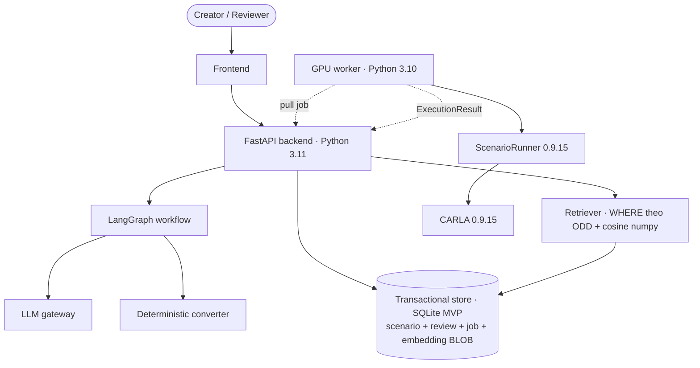
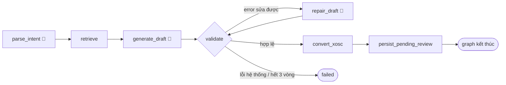
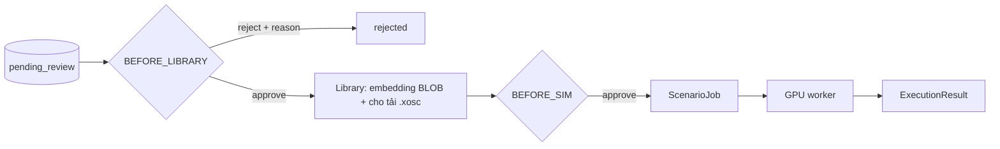

# Kiến trúc — Scenario Forge (RAV-03)

Tài liệu này là Deliverable Architecture duy nhất: chứa sơ đồ, workflow,
contracts, ranh giới hệ thống và trạng thái triển khai. Lý do từng quyết định nằm
trong [`docs/adr/`](docs/adr/README.md).

> Nguồn sự thật về dữ liệu là `src/models/schemas.py`. Nguồn sự thật về quyết
> định là ADR. Nếu tài liệu này vênh với hai nguồn đó, tài liệu này sai.

## Mục tiêu

Kỹ sư nhập một câu tiếng Việt mô tả tình huống giao thông nguy hiểm. Hệ thống
sinh file OpenSCENARIO 1.0 (`.xosc`), lưu ở trạng thái chờ review, cho tải sau
khi được duyệt và có thể gửi sang CARLA ScenarioRunner để kiểm chứng.

Sản phẩm chính là file `.xosc`; CARLA là tầng kiểm chứng tuỳ chọn.

## Sơ đồ hệ thống mục tiêu



- Backend cloud không `import carla`.
- Worker nhận chuỗi XML, không nhận object Python.
- Worker offline không làm chết đường generate/review/download ở chế độ static.
- Transactional store là nguồn thật duy nhất: state giao dịch và embedding nằm cùng một `.db`, nên không có index ngoài để lệch (ADR-013).
- Local, test và CI dùng SQLite. **Bản deploy có Live URL dùng Supabase PostgreSQL ngay từ lần deploy đầu** — Render free có filesystem ephemeral nên file SQLite bị xoá mỗi lần redeploy/wake-up (ADR-011 §3.6). Cùng một repository layer qua SQLAlchemy Core.

## Workflow 7 nodes

Đây là kiến trúc mục tiêu. Graph hiện tại vẫn là graph mẫu `analyze → respond`;
`routing.py`, data contracts và fixtures đã có thật.



`parse_intent` bao gồm hai thao tác code thuần ngay sau structured output:

- Điền mặc định cho trục bối cảnh được phép thiếu và ghi `Assumption`.
- Kiểm thiếu actor/maneuver hoặc tổ hợp ngoài `SupportPolicy`; thất bại trả lỗi
  có cấu trúc để API chuyển thành `422`.

Hai thao tác này không có retry/checkpoint/I/O độc lập nên không phải nodes.
`ScenarioSpec.promote()` cũng chỉ là hàm backend chạy sau validation, không phải node.

### Contract từng node

| Node | Input | Output | Trách nhiệm |
|---|---|---|---|
| `parse_intent` | `user_query` | `ODDQuery`, `ODDCell`, assumptions hoặc lỗi hỗ trợ | Hiểu câu và chuẩn hoá intent |
| `retrieve` | câu + `ODDQuery.as_filter()` | tối đa 3 `ScenarioSpec` | Vector search + payload filter |
| `generate_draft` | câu + ODD + examples | `ScenarioDraft` | Sinh nội dung semantic có cấu trúc |
| `validate` | `ScenarioDraft` | `list[ValidationIssue]` | Schema, invariants và static geometry |
| `repair_draft` | draft + lỗi sửa được | `ScenarioDraft` mới | Sửa nội dung, tối đa ba vòng |
| `convert_xosc` | `ScenarioSpec` đã promote | `xosc_content: str` | Biên dịch deterministic sang XML |
| `persist_pending_review` | spec + XML + provenance | scenario `pending_review` | Ghi durable state rồi kết thúc graph |

### Routing sau validate

```text
không còn error                 → promote → convert_xosc
có lỗi không sửa được           → failed ngay
còn lỗi sửa được, iteration < 3 → repair_draft
iteration >= 3                  → failed
```

Warning không chặn flow; reviewer nhìn thấy warning ở cổng duyệt.

## Ví dụ từng node

Một câu đi hết pipeline. Mọi giá trị dưới đây **lấy từ `fixtures/`**, không phải
viết tay minh hoạ — fixtures có test validate theo `schemas.py`, nên ví dụ ở đây
không lệch được khỏi contract. Muốn xem đầy đủ thì mở file được trích dẫn.

Câu vào (`fixtures/scenario_specs/sc_001.json` → `description_vi`):

> *"Xe máy chạy 80 km/h ở làn bên trái, vượt lên từ phía sau ô tô đang chạy
> 60 km/h, tạt đầu rồi phanh gấp còn 40 km/h. Trời quang, ban ngày, cao tốc."*

**`parse_intent`** — output *duy nhất* của LLM là `ODDQuery`; mọi trục đều có thể
rỗng:

```json
{"road_type": "highway", "weather": "clear",
 "actor_type": "motorcycle", "maneuver": "cut_in", "inferred": []}
```

`inferred` rỗng vì câu này nói rõ cả 4 trục. Câu *"xe máy tạt đầu lúc mưa"* chỉ
điền được 2 trục, phần còn lại do `ODDQuery.with_defaults()` — code thuần, không
phải LLM — điền và sinh `list[Assumption]`.

**`retrieve`** — `ODDQuery.as_filter()` cho `WHERE`, phần còn lại là cosine:

```python
{"road_type": "highway", "weather": "clear",
 "actor_type": "motorcycle", "maneuver": "cut_in"}   # → tối đa 3 ScenarioSpec
```

**`generate_draft`** — input là `ODDCell` (đủ 4 trục) + examples; output
`ScenarioDraft`, tức `sc_001.json` **bỏ đi** `scenario_id` và `description_vi`:

```json
{"actors": [
   {"name": "hero",      "category": "car",        "position": {"lane_offset": 0,  "s_offset_m":   0.0}, "initial_speed_kmh": 60.0, "is_ego": true},
   {"name": "adversary", "category": "motorcycle", "position": {"lane_offset": -1, "s_offset_m": -25.0}, "initial_speed_kmh": 80.0, "is_ego": false}],
 "maneuvers": [
   {"actor_name": "adversary", "maneuver": "cut_in",
    "trigger": {"type": "simulation_time", "value": 7.0}, "target_speed_kmh": 40.0}]}
```

`s_offset_m: -25.0` là chỗ dễ sai nhất: muốn vượt lên rồi tạt đầu thì actor phải
xuất phát **phía sau** ego. `hero` là tên actor theo quy ước của fixtures, không
phải một trường role — vai ego nằm ở `is_ego`.

**`validate`** — đổi dấu `s_offset_m` thành `+20.0` mà vẫn giữ 80 km/h thì schema
vẫn hợp lệ nhưng hình học vô nghĩa: xe máy ở phía trước và chạy nhanh hơn thì
khoảng cách chỉ nới rộng. Đó là `fixtures/invalid_drafts/geom_no_catchup.json`:

```json
{"caught_by": "static_check", "expected_codes": ["GEOM_NO_CATCHUP"]}
```

12 file trong `invalid_drafts/` là bộ đề của validator — mỗi file tự khai nó sai
code gì và ai phải bắt được.

**`repair_draft`** — nhận draft + issue trên, trả draft mới. Chỉ code thuộc
`REPAIRABLE_CODES` mới đi đường này; tối đa ba vòng.

**`convert_xosc`** — đích đến là `fixtures/xosc/sample_001_cut_in.xosc` (viết
tay). Bài test đầu tiên của converter chính là:

```text
convert(fixtures/scenario_specs/sc_001.json) == sample_001_cut_in.xosc   (sau chuẩn hoá)
```

**`persist_pending_review`** — ghi `ScenarioSpec` + XML + provenance, scenario ở
`pending_review`, graph kết thúc. `ExecutionResult` tương ứng cho UI dựng trước
khi có backend nằm ở `fixtures/execution_results/`.

## Sau workflow

Review và simulation là các HTTP transaction độc lập, không phải nodes đứng chờ
trong graph.



- `BEFORE_LIBRARY`: yêu cầu sản phẩm, ngăn dữ liệu xấu quay lại làm few-shot.
- `BEFORE_SIM`: chính sách đội để kiểm soát tài nguyên GPU.

## Data lifecycle

```text
câu gốc
→ ODDQuery
→ ScenarioDraft
→ ScenarioSpec
→ xosc_content
→ ScenarioJob
→ ExecutionResult
→ LibraryEntry
```

LLM không cấp `scenario_id` và không viết lại `description_vi`. Backend cấp ID
và copy nguyên văn câu người dùng khi promote draft thành spec.

## Ranh giới hệ thống

| Ranh giới | Dữ liệu đi qua | Bất biến |
|---|---|---|
| LLM ↔ backend | `ODDQuery`, `ScenarioDraft` | structured output, `extra="forbid"` |
| Spec ↔ converter | `ScenarioSpec` | spec không chứa khái niệm riêng của CARLA |
| Cloud ↔ GPU worker | `ScenarioJob.xosc_content` | không chia sẻ Python object/venv |
| Transaction ↔ retrieval | truy cập qua interface `Retriever` | chỉ scenario qua `BEFORE_LIBRARY` mới có embedding để tìm lại |
| Workflow ↔ human | durable `pending_review` state | không chờ trong process memory |

## Converter và CARLA

Converter chạy trên CPU backend và dùng template catalog để ánh xạ semantic spec
sang subset OpenSCENARIO mà ScenarioRunner 0.9.15 hỗ trợ. `RelativeLanePosition`
cho phép giữ actor tương đối theo ego; chỉ ego cần một `WorldPosition` anchor theo
template.

Smoke test ngày 31/07/2026 đã xác nhận:

- Windows CARLA server ↔ WSL2 ScenarioRunner client hoạt động.
- Python 3.10 wheel tương thích CARLA 0.9.15.
- `RelativeLanePosition` đặt actor đúng làn và khoảng cách.
- ScenarioRunner xuất criteria JSON có thể chuẩn hoá thành `ExecutionResult`.

Smoke test chưa chứng minh converter tự động hoặc outcome cut-in/collision ổn định.
Các parser traps và giới hạn nằm ở
[ADR-012](docs/adr/ADR-012-converter-dung-relativelaneposition.md).

## Bất biến được kiểm bằng CI

- `src/` không import `carla`.
- HTTP layer không truy vấn retrieval store trực tiếp; mọi tìm kiếm đi qua `Retriever`. *(Test hiện tại chặn `import qdrant` trong router — sẽ đổi sang chặn import implementation của `Retriever` khi hiện thực, xem §Hệ quả của ADR-013.)*
- Chỉ `parse_intent`, `generate_draft`, `repair_draft` được phép gọi LLM.
- Mọi provider call đi qua `src/services/llm.py`.
- Fixtures phải validate theo `schemas.py`.

## Trạng thái hiện tại

| Thành phần | Trạng thái |
|---|---|
| `schemas.py`, fixtures | ✅ Có |
| Routing và architecture tests | ✅ Có |
| CARLA/ScenarioRunner smoke test | ✅ Toolchain pass |
| Graph 7 nodes | ⏳ Graph hiện vẫn là template |
| Static validator, templates, converter | ⏳ Chưa có |
| `Retriever` (SQLite BLOB + cosine) và retrieval baseline | ⏳ Chưa có |
| SQLite persistence, review/download/job API | ⏳ Chưa có |
| Frontend và preview | ⏳ Chưa có |
| GPU worker | ⏳ Chưa có implementation |
| Evaluation report bằng số thật | ⏳ Chưa có |

## Quy tắc thay đổi

- Đổi hình dạng dữ liệu: sửa `schemas.py`, fixtures và tests trong cùng PR.
- Đổi quyết định Accepted: viết ADR mới và supersede ADR cũ.
- Đổi workflow: cập nhật graph, routing tests và bảng contract ở đây.
- Ownership, deadline và tiến độ theo ngày chỉ nằm trong GitHub Issues/Project.
