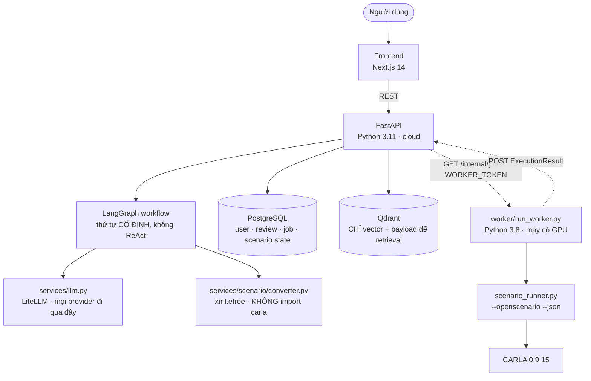
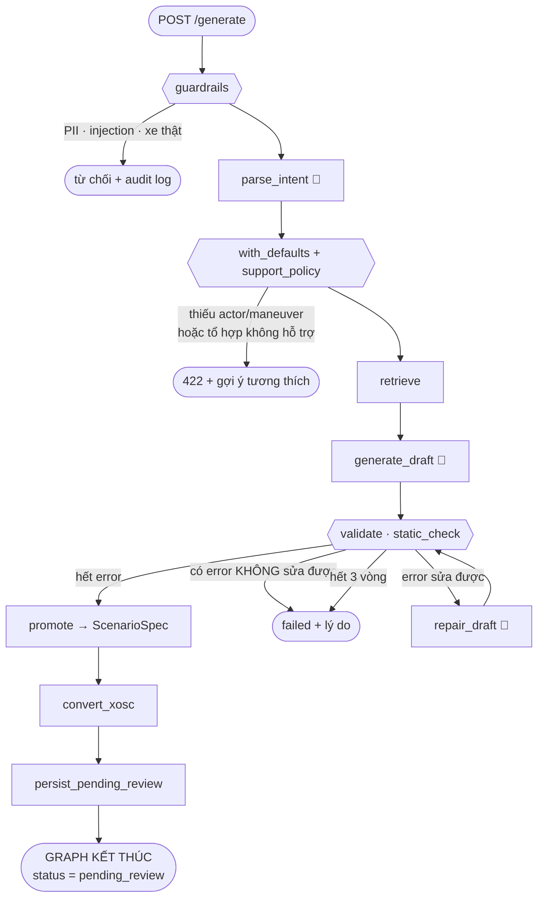
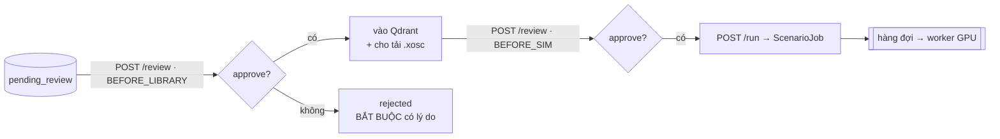
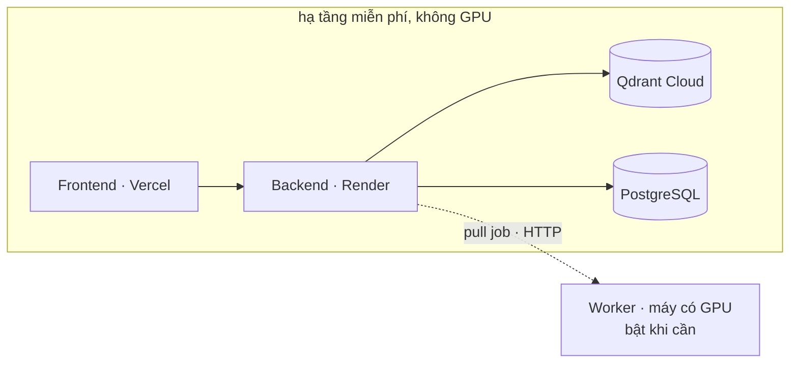

# Sơ đồ kiến trúc — Scenario Forge

> Nguồn sự thật là `src/models/schemas.py` + `docs/adr/`. Sơ đồ ở đây chỉ vẽ lại
> thứ đã chốt ở đó. Vênh nhau thì **ADR đúng, sơ đồ sai** — sửa sơ đồ.

## Toàn hệ thống

Ranh giới module = **ranh giới GPU** (ADR-001). Đường đứt nét là chỗ đổi máy và
đổi venv; thứ đi qua nó là **chuỗi XML**, không phải object Python.

- **PostgreSQL là nguồn thật cho dữ liệu giao dịch; Qdrant không phải** — `plan.md` §10. Chờ ADR-011.
- Worker **pull**, backend không gọi worker. Worker tắt thì Live URL vẫn phục vụ `validation_mode=static` (ADR-001).
- Không dùng ChromaDB của template — ADR-003 chọn Qdrant vì cần *payload filter kết hợp vector search*.

## Luồng xử lý

**Thứ tự do code quyết, không phải LLM.** Đây là bằng chứng PLO1/PLO2 — không có
node nào hỏi mô hình "bước tiếp theo là gì". Lập luận đầy đủ ở `plan.md` §3 + ADR-007.

🤖 = gọi LLM. **Đúng ba node**, tất cả đi qua `services/llm.py`. Phần còn lại là
code thuần — điều kiện rẽ nhánh ở `src/agents/routing.py`, test được mà không cần
mock LLM. Vòng lặp duy nhất là `validate ↔ repair_draft`, trần cứng 3 vòng.

## Hai cổng duyệt — KHÔNG nằm trong graph

Graph kết thúc ở `pending_review` và ghi xuống DB. Mọi thứ sau đó là **HTTP
transaction riêng**, vì Render free tier ngủ khi không có request: thứ gì "đứng
chờ" trong RAM đều chắc chắn chết (`schemas.py`, `ReviewDecision`).

Cổng 1 là **[Đề bắt buộc]**; cổng 2 là **chính sách đội bổ sung** để kiểm soát GPU.

## Hợp đồng dữ liệu từng bước

| Bước | Vào | Ra |
|---|---|---|
| `parse_intent` | câu tiếng Việt | `ODDQuery` (kèm trục nào là suy luận) |
| `retrieve` | câu + `as_filter()` | ≤3 `ScenarioSpec` làm few-shot |
| `generate_draft` | câu + `ODDCell` + few-shot | `ScenarioDraft` — **không có `scenario_id`** |
| `validate` | `ScenarioDraft` | `list[ValidationIssue]` (error / warning) |
| `repair_draft` | draft + issue sửa được | `ScenarioDraft` |
| promote | draft | `ScenarioSpec` — backend cấp id, copy câu gốc |
| `convert_xosc` | `ScenarioSpec` | `.xosc` (chuỗi XML) |
| worker | `ScenarioJob.xosc_content` | `ExecutionResult` |

## Triển khai

Worker offline **không** làm chết web: `validation_mode=static` phục vụ được toàn
bộ đường đi từ câu tiếng Việt tới file `.xosc` tải được. Đó là bất biến giữ
Deliverable #5 sống.

---

*File này chỉ chứa **sơ đồ**. Bảng thành phần, ranh giới, an toàn và trạng thái
nằm ở [`ARCHITECTURE.md`](../ARCHITECTURE.md) — cố ý không nhân đôi.*
