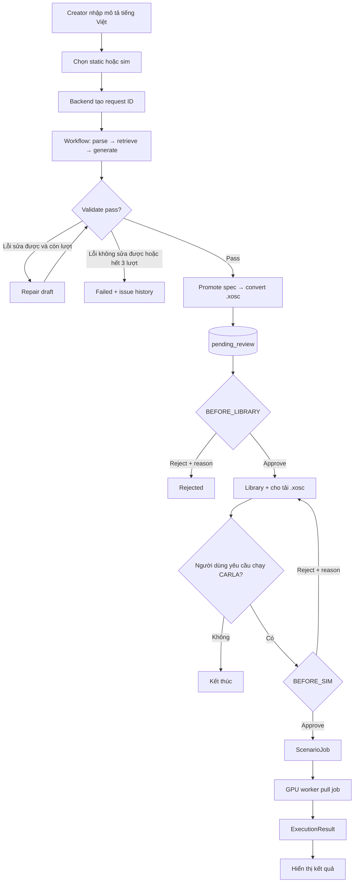
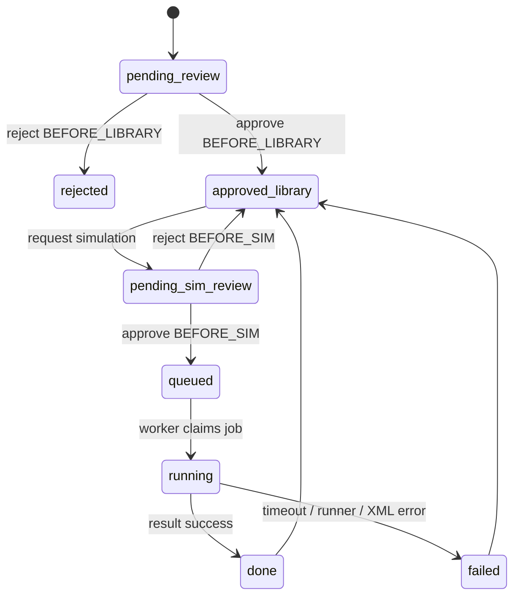

# Wireframe & UI Flow — Scenario Forge

> **Mã đề tài:** P-130 · RAV-03<br>
> **Mức độ:** Low-fidelity design cho MVP; endpoint cụ thể sẽ được chốt cùng API contract

## 1. Nguyên tắc thiết kế

- Dẫn người dùng từ một câu tiếng Việt tới một file `.xosc` có thể review và tải.
- Luôn phân biệt **workflow xử lý tự động** với **hai transaction duyệt của con
  người**.
- Static path không phụ thuộc GPU; trạng thái worker phải được hiển thị nhưng
  không chặn generate/review/download.
- UI chỉ gọi backend API; không kết nối trực tiếp Qdrant hoặc CARLA.
- Câu gốc, assumptions, warnings và người duyệt phải nhìn thấy được để tránh
  “thành công giả”.

## 2. Information architecture

```text
Scenario Forge
├── Generator
│   ├── Prompt + validation mode
│   ├── Processing status
│   └── Result preview
├── Review Queue
│   ├── BEFORE_LIBRARY
│   └── BEFORE_SIM
└── Scenario Library
    ├── Search + ODD filters
    ├── Scenario detail
    ├── Download .xosc
    └── Request simulation
```

## 3. Luồng tổng thể



## 4. Wireframe 1 — Generator

```text
┌──────────────────────────────────────────────────────────────────────────┐
│ Scenario Forge                                      Worker: Offline ●   │
├──────────────────────────────────────────────────────────────────────────┤
│ Mô tả tình huống                                                        │
│ ┌──────────────────────────────────────────────────────────────────────┐ │
│ │ Xe máy chạy từ phía sau, vượt lên, tạt đầu ô tô rồi phanh gấp.      │ │
│ └──────────────────────────────────────────────────────────────────────┘ │
│ Validation:  (●) Static   ( ) Sim                 [Sinh kịch bản]       │
├──────────────────────────────────────────────────────────────────────────┤
│ Tiến độ                                                                 │
│ ✓ Parse  ✓ Retrieve  ● Generate  ○ Validate  ○ Convert  ○ Save         │
│ Repair: 0/3                                                             │
├───────────────────────────────────┬──────────────────────────────────────┤
│ Tóm tắt & ODD                     │ Preview 2D                           │
│ Road: urban_straight              │  ───────── lane -1 ─────────        │
│ Weather: clear                    │       [MOTO] ───────→                │
│ Actor: motorcycle                 │  ───────── lane  0 ─────────        │
│ Maneuver: cut_in                  │             [HERO] ───→              │
│ Assumptions: 1 · Warnings: 0      │  ───────── lane +1 ─────────        │
├───────────────────────────────────┴──────────────────────────────────────┤
│ [Xem JSON] [Xem XML]                               [Mở yêu cầu duyệt] │
└──────────────────────────────────────────────────────────────────────────┘
```

### Trạng thái Generator

| State | UI behavior |
|---|---|
| Empty | Disable Generate; hướng dẫn bằng một ví dụ ngắn |
| Processing | Giữ request ID; hiển thị node hiện tại và số vòng repair |
| Validation failed | Hiển thị issue code, trường lỗi, giải thích và gợi ý; cho sửa prompt/thử lại |
| Pending review | Khoá artifact theo version; cho mở trang review |
| Worker offline | Disable lựa chọn/chạy sim nếu cần, nhưng static path vẫn hoạt động |

## 5. Wireframe 2 — HITL Review

```text
┌──────────────────────────────────────────────────────────────────────────┐
│ Review #sc_042                                      Gate: BEFORE_LIBRARY│
├───────────────────────────────────┬──────────────────────────────────────┤
│ Câu gốc                           │ Preview 2D                           │
│ “Xe máy chạy từ phía sau...”      │  ───────── lane -1 ─────────        │
│                                   │       [MOTO] ↘                       │
│ ODD                               │  ───────── lane  0 ─────────        │
│ urban_straight · clear            │             [HERO] ───→              │
│ motorcycle · cut_in               │                                      │
├───────────────────────────────────┼──────────────────────────────────────┤
│ Assumptions                       │ Warnings                             │
│ • weather mặc định clear          │ • lane width chưa kiểm bằng map      │
├───────────────────────────────────┴──────────────────────────────────────┤
│ Reviewer *  [________________________________________]                  │
│ Reason      [________________________________________]                  │
│             [________________________________________]                  │
│                                                                          │
│ [Xem JSON] [Xem .xosc]                    [Reject]  [Approve]           │
└──────────────────────────────────────────────────────────────────────────┘
```

### Quy tắc Review

- `reviewer` bắt buộc cho cả Approve và Reject.
- `reason` bắt buộc khi Reject, tối đa 1000 ký tự.
- Trang phải hiển thị rõ `BEFORE_LIBRARY` hay `BEFORE_SIM`; không cho người dùng
  tự đổi gate bằng dropdown.
- Approve `BEFORE_LIBRARY` mở quyền download và tạo Qdrant projection.
- Approve `BEFORE_SIM` mới cho backend tạo `ScenarioJob`.
- Mỗi quyết định gắn với đúng version của spec/XML đang hiển thị.

## 6. Wireframe 3 — Scenario Library

```text
┌──────────────────────────────────────────────────────────────────────────┐
│ Scenario Library                                                        │
├──────────────────────────────────────────────────────────────────────────┤
│ Search [xe máy tạt đầu_________________] [Tìm]                           │
│ Road [All▼] Weather [All▼] Actor [All▼] Maneuver [All▼] [Xoá lọc]      │
├──────────────────────────────────────────────────────────────────────────┤
│ sc_042 · Xe máy tạt đầu                         Approved                │
│ urban_straight · clear · motorcycle · cut_in                            │
│ Last run: success=true · CollisionTest=FAILURE                          │
│ [Xem chi tiết] [Tải .xosc] [Yêu cầu chạy CARLA]                        │
├──────────────────────────────────────────────────────────────────────────┤
│ sc_057 · Người đi bộ băng ngang                  Approved                │
│ intersection · rain · pedestrian · jaywalk                              │
│ Last run: Chưa chạy                                                     │
│ [Xem chi tiết] [Tải .xosc] [Yêu cầu chạy CARLA]                        │
└──────────────────────────────────────────────────────────────────────────┘
```

## 7. Luồng trạng thái review và simulation



## 8. Error và empty states

| Tình huống | Thông báo/hành động |
|---|---|
| Prompt rỗng | “Nhập mô tả tình huống trước khi sinh kịch bản.” |
| Input thiếu actor/maneuver bắt buộc | Yêu cầu bổ sung thông tin; không tự đoán phần quyết định tình huống |
| Không có retrieval result | “Chưa có ví dụ tương tự; hệ thống tiếp tục không dùng few-shot.” |
| Hết ba vòng repair | Hiển thị issue history; cho sửa prompt và tạo request mới |
| Converter lỗi | Báo lỗi hệ thống có request ID; không tạo pending scenario giả |
| Worker offline | Static path vẫn dùng được; nút simulation giải thích trạng thái |
| Simulation timeout/fail | Phân biệt lỗi thực thi với criteria của tình huống |
| Empty library | Hướng dẫn tạo và duyệt scenario đầu tiên |

## 9. Responsive và accessibility

- Desktop dùng hai cột cho thông tin và preview; mobile xếp preview dưới tóm tắt.
- Mọi trạng thái không chỉ biểu diễn bằng màu; luôn có label/icon/text.
- Form có label thật, focus state và thứ tự tab rõ ràng.
- Approve/Reject cần confirmation khi thao tác làm thay đổi trạng thái durable.
- XML/JSON dài được đặt trong vùng cuộn và có nút copy/download.

## 10. Ranh giới contract tại Gate 1

- `POST /generate`, polling status, review, download và job là contract mục tiêu;
  tên path cuối cùng cần chốt khi dựng API.
- Frontend, review API, persistence và worker chưa được coi là đã implement chỉ
  vì chúng xuất hiện trong wireframe.
- Source of truth cho data shape là `src/models/schemas.py`; thay đổi contract
  cần được phản ánh lại trong UI states và acceptance criteria.
